

**Author:** Dustin Littlefield  
**Portfolio:** https://github.com/dustinlit  
**Project Type:** `Remote Sensing` `Wildfire Ecology` `Spatial Analysis`  
**Technologies:** `ArcGIS Pro` `Python` `Sentinel-2` `NDVI` `NBR` `dNBR`  
**Last Updated:** March 2026

## Introduction
In recent years, wildfires in the northwest have grown increasingly severe and more frequent. Halofsky et al. (2020) explains that increasing temperatures due to the shifting climate are producing increased fuel dryness, increased evaporative demand, and decreased soil moisture. As these conditions shift, there is likely to be increases in both the number of wildfire events and the area of forest burned per event. 

With this escalation comes a need for additional fire mitigation efforts, long-term forest recovery management, and improved emergency resource planning. Satellite based remote sensing provides cost-effective methods to analyze the growing impact of wildfires. Indices like the Normalized Difference Vegetation Index (NDVI), the Normalized Burn Ratio (NBR) and the difference Normalized Burn Ratio (dNBR) can be used to assess extensive areas efficiently by evaluating vegetative health, delineating fire footprints, or classifying burn severity.

In 2020, the Beachie Creek-Lionshead complex fire devastated a large section of the northern and central Cascade Mountain region stretching from the foothills in the Willamette Valley to the desert in Central Oregon. This complex measured over 56 miles from edge to edge, spanned 5 counties, and burned a total of nearly 400,000 acres (Figure 1). Both fires ignited in separate locations on August 16, 2020. On Labor Day, 9/7/2020, a massive wind event caused the fires to merge near the central divide of the Cascades, producing one of the largest and most severe burns in Oregon history. Various social and economic impacts still resonate throughout the region, including: (1) the destruction of over 700 homes and displacement of hundreds of people, (2) the loss of old-growth forest that serves as a critical habitat for many species including the Spotted Owl, and (3) significant soil loss, which can lead to long-term changes in the regions watershed hydrology. 

<figure>
  <figcaption style="font-size:0.9em; margin-bottom:8px;">
    <strong>Figure 1.</strong> Overview of the burned area for the Beachie Creek–Lionshead Complex. 
    <em>Map Author: Dustin Littlefield PCS: WGS 1984 UTM 10N 
    Source: Oregon Department of Forestry (2022)</em>
  </figcaption>
  
</figure>
 
## Data
For analysis of the fires, Sentinel-2B Imagery was obtained from the Copernicus Data Space Ecosystem (CDSE). The spectral regions used were collected from the Sentinel-2B Multispectral Instrument (MSI) and are listed in Table 1. To maintain consistency throughout the analysis the 10m spectral bands (2,3,4, and 8) were resampled to 20m to match the SWIR bands (11,12), which are essential for capturing burn scars and delineating the wildfires footprint. 

<figure>
  <figcaption style="font-size:0.9em; margin-bottom:8px;">
    <strong>Table 1.</strong> Sentinel-2 spectral band details.
  </figcaption>
  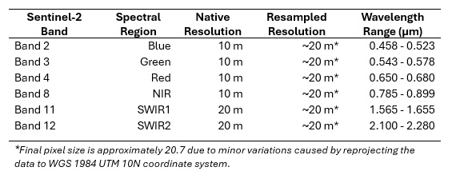
</figure>

Two Sentinel-2B swaths (10TEQ and 10TFQ) were required to encompass the study area. The post-fire date selected is October 29, 2020, which was selected to avoid heavy winter snowfall which could obscure vegetation analysis. Although this date precedes the fires’ final containment date on December 20, 2020, much of the burn area was established by then. The pre-fire imagery date selected is July 31, 2020, as it is the closest day to ignition containing the least amount of cloud cover. Surface reflectance data from both dates were first resampled using the bilinear method, combined to a mosaic, and clipped to the study area. Supplementary vegetation data was also obtained from the Institute for Natural Resources (INR) from Oregon State University.

<figure>
  <figcaption style="font-size:0.9em; margin-bottom:8px;">
    <strong>Figure 2.</strong> False color SWIR2–NIR–Red composite of the Beachie Creek and Lionshead fire perimeters (Oct 29, 2020).  
    <em>Map Author: Dustin Littlefield PCS: WGS 1984 UTM 10N.  
    Source: Copernicus Data Space Ecosystem (Sentinel‑2B MSI), European Union/ESA.</em>
  </figcaption>
  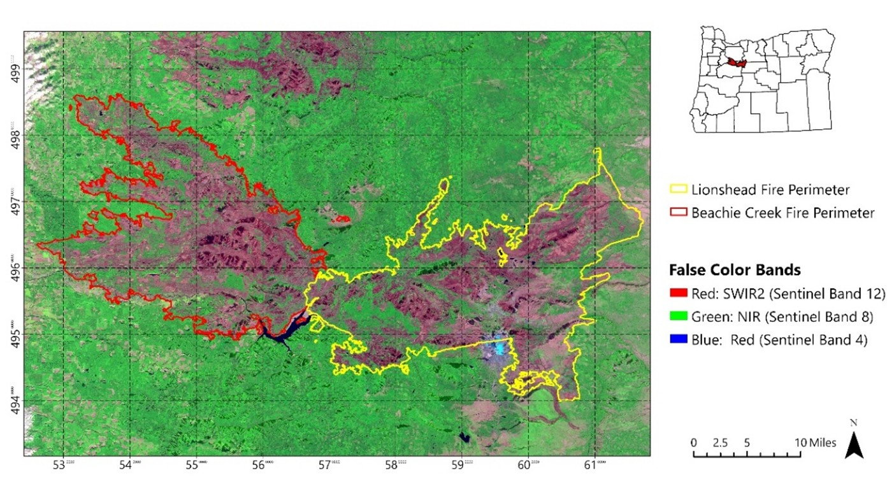
</figure>

## Methodology and Results

Normalized Difference Vegetation Index (NDVI)
The Normalized Difference Vegetation Index (NDVI) is a commonly used metric to give a general assessment of post fire vegetative health and measure the degree biomass loss. Healthy and growing plants absorb red light to produce energy by photosynthesis and reflect light in the near infrared spectrum, while burned or dead vegetation have the opposite spectral signature.  Calculations for this case use Sentinel-2B Multispectral Instrument (MSI) bands 8 (NIR) and 4 (Red). The NDVI is calculated with the formula:

<math display="block">
  <mrow>
    <mi>NDVI</mi>
    <mo>=</mo>
    <mfrac>
      <mrow>
        <mi>NIR</mi>
        <mo>−</mo>
        <mi>Red</mi>
      </mrow>
      <mrow>
        <mi>NIR</mi>
        <mo>+</mo>
        <mi>Red</mi>
      </mrow>
    </mfrac>
  </mrow>
</math>

<figure>
  <figcaption style="font-size:0.9em; margin-bottom:8px;">
    <strong>Figure 3.</strong> NDVI overlays of Sentinel‑2B images from pre‑ and post‑fire. Higher NDVI values (0.4–0.8, green) indicate healthy vegetation, and lower values (0–0.4, pink) indicate vegetation loss or bare soil. 
    <em>Map Author: Dustin Littlefield PCS: WGS 1984 UTM 10N 
    Source: Copernicus Data Space Ecosystem (Sentinel‑2B MSI), European Union/ESA</em>
  </figcaption>
  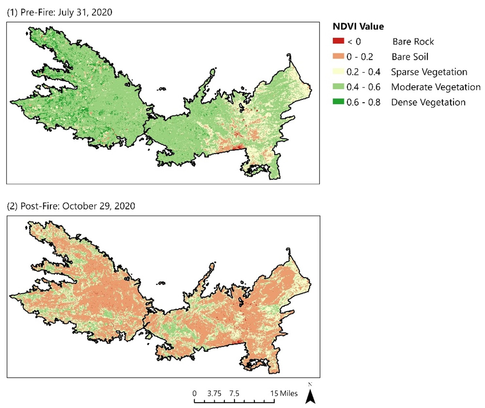
</figure>
 

Pre-fire conditions show dense vegetation (green) across much of the western and eastern regions of the Cascades. In the far west, the forest cover transitions to agricultural fields in the foothills which display as a darker green due to actively growing crops. The eastern area shows a patchier NDVI due to the higher elevation, drier mountains where wildfires have previously reduced the biomass. Post-fire NDVI shows a massive conversion to bare soil and an almost complete loss of dense vegetation in both burn areas (Table 2).

<figure>
  <figcaption style="font-size:0.9em; margin-bottom:8px;">
    <strong>Table 2.</strong> Percent change from pre‑fire to post‑fire NDVI values.
  </figcaption>
  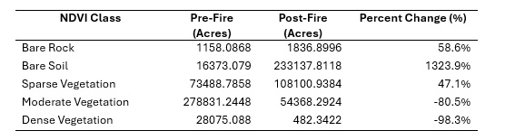
</figure>

### NBR and difference NBR
The Normalized Burn Ratio (NBR) is a spectral index that is specifically used to visualize burn scars by contrasting the NIR reflectance of healthy vegetation against SWIR2 reflectance, which is reflected by charred soils and vegetation. For this study, Sentinel-2B MSI reflectance is used from bands 8 (NIR) and 12 (SWIR2). The NBR is calculated as: 

<math display="block">
  <mrow>
    <mi>NBR</mi>
    <mo>=</mo>
    <mfrac>
      <mrow>
        <mi>NIR</mi>
        <mo>−</mo>
        <mi>SWIR2</mi>
      </mrow>
      <mrow>
        <mi>NIR</mi>
        <mo>+</mo>
        <mi>SWIR2</mi>
      </mrow>
    </mfrac>
  </mrow>
</math>
 

The difference Normalized Burn Ratio (dNBR) is an additional metric that can be used to quantify the severity of a fire by measuring the spectral change in NBR from two time periods. The dNBR values range from 1 to -1. Higher values (.5 to 1) correlate with a significant transition from healthy vegetation to charred soil and ash. It is calculated with the formula: 

<math display="block">
  <mrow>
    <mi>dNBR</mi>
    <mo>=</mo>
    <mrow>
      <msub>
        <mi>NBR</mi>
        <mi>prefire</mi>
      </msub>
      <mo>−</mo>
      <msub>
        <mi>NBR</mi>
        <mi>postfire</mi>
      </msub>
    </mrow>
  </mrow>
</math>

### Burn Severity Classification
Further standardized classification is provided by the USGS to categorize the severity of burns from dNBR values (U.S. Geological Survey n.d.). This system was used to identify spatial patterns associated with the intensity of burns in the study area (Table 3). 

<figure>
  <figcaption style="font-size:0.9em; margin-bottom:8px;">
    <strong>Table 3.</strong> Standardized USGS breakdown of dNBR burn severity categories.
  </figcaption>
  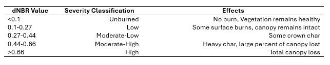
</figure>

Figure 4 visualizes the Beachie Creek and Lionshead fires as classified with the USGS burn severity categories. The Western Cascade portion of the burn shows significant clusters of higher severity burns when compared with the Eastern Cascade region, most likely due to higher tree density. Both fires were largely concentrated in the northern section of Willamette National Forest with only minimal extension into Mt. Hood National Forest to the north. The Beachie Creek fire threatened the southern boundary of Silver Falls State Park, a popular location among residents known for its multitude of waterfalls. The Lionshead fire branched into Warm Springs Reservation with pockets of high severity in the northern portion. This region has wider vegetative spacing and is dominated by dry pines and scattered sagebrush, contributing to lower severity in some areas. The intensity distribution throughout the fire was spread relatively evenly among the moderate, low and unburned categories (Table 4). However, over 50% of the perimeter is classed moderate or higher, showing the fires large impact on the landscape.

<figure>
  <figcaption style="font-size:0.9em; margin-bottom:8px;">
    <strong>Figure 4.</strong> Burn severity overview of the Beachie Creek–Lionshead Complex. 
    <em>Map Author: Dustin Littlefield — PCS: WGS 1984 UTM 10N 
    Source: Copernicus Data Space Ecosystem (Sentinel‑2B MSI), European Union/ESA</em>
  </figcaption>
  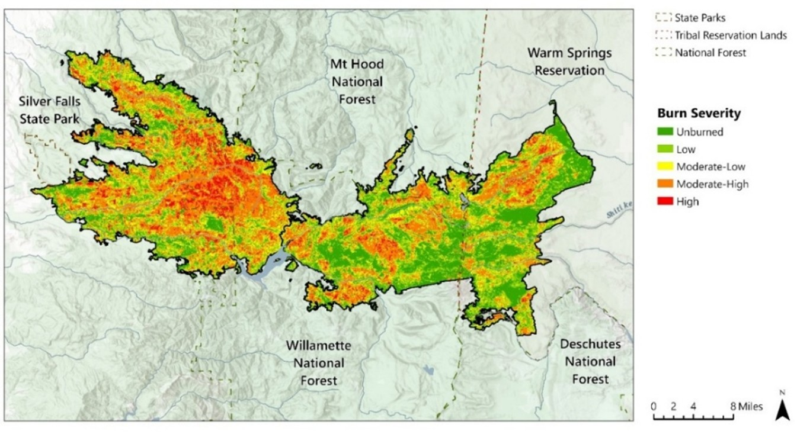
</figure>

<figure>
  <figcaption style="font-size:0.9em; margin-bottom:8px;">
    <strong>Table 4.</strong> Burn classification statistics for the Beachie Creek–Lionshead Complex.
  </figcaption>
  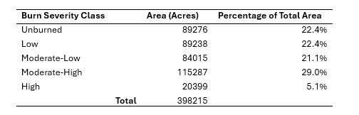
</figure>

### Social Impacts
The most devastating social impacts of the fires were seen in the small communities of Detroit and Idanha. These towns reside near Detroit Lake on Oregon Highway 22, situated near the central divide of the Eastern and Western Cascade Mountains. They are largely recreational communities centered around outdoor activities. An extreme wind event on Labor Day, September 7, 2020, caused both fires to converge on these communities, resulting in the complete destruction of structures in both towns. Figure 5 shows the high intensity of burn severity surrounding the towns. There are two notable indicators highlighting the extreme intensity of this event: (1) the fire made an unusually large jump to the center of the lake and almost completely burned the vegetation on Piety Island, and (2) intense burns are usually concentrated on southern slopes, but in this event, the northern slopes exhibit equally high severity. 

<figure>
  <figcaption style="font-size:0.9em; margin-bottom:8px;">
    <strong>Figure 5.</strong> Burn severity classification of Detroit and Idanha communities. 
    <em>Map Author: Dustin Littlefield PCS: WGS 1984 UTM 10N 
    Source: Copernicus Data Space Ecosystem (Sentinel‑2B MSI), European Union/ESA</em>
  </figcaption>
  
</figure>

In the western region of the Cascades, the Beachie Creek fire threatened several communities along Highway 22. The Highway was eventually completely overtaken, cutting off the only evacuation route out of the mountains. The town of Gates, which was the staging point of firefighting efforts, had to be completely abandoned as it was completely devastated by the fire. The small towns of Mill City and Lyons were also evacuated but were ultimately spared from the fire. 

<figure>
  <figcaption style="font-size:0.9em; margin-bottom:8px;">
    <strong>Figure 6.</strong> Burn severity classification of the Beachie Creek fire near Western Cascade communities. 
    <em>Map Author: Dustin Littlefield PCS: WGS 1984 UTM 10N 
    Source: Copernicus Data Space Ecosystem (Sentinel‑2B MSI), European Union/ESA</em>
  </figcaption>
  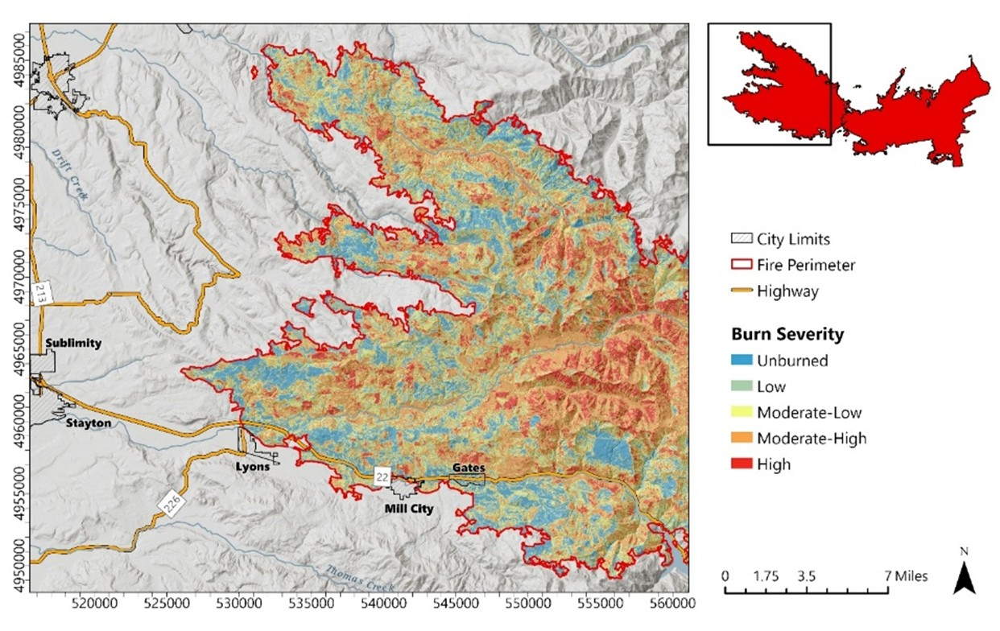
</figure>

In the Eastern Cascades, the Lionshead fire burnt a large swath of the Warm Springs tribal reservation. Intensity was spotty in this region with clusters of high severity located in the northern section of the burn. The climate of this region is typically drier, and vegetation is more dispersed, leading to less overall severity.

<figure>
  <figcaption style="font-size:0.9em; margin-bottom:8px;">
    <strong>Figure 7.</strong> Burn severity classification of the Lionshead fire in Warm Springs Reservation. 
    <em>Map Author: Dustin Littlefield PCS: WGS 1984 UTM 10N 
    Source: Copernicus Data Space Ecosystem (Sentinel‑2B MSI), European Union/ESA</em>
  </figcaption>
  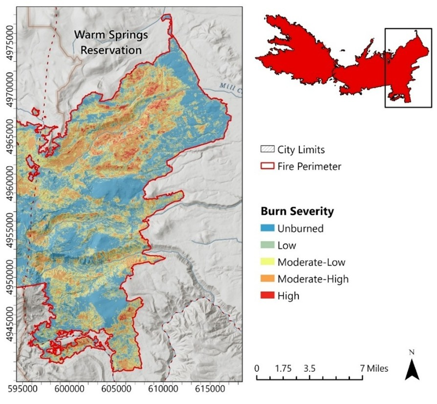
</figure>

### Tree Mortality
Research by Van Wagtendonk, Root, and Key (2004) demonstrates a strong correlation of the Landsat 7 ETM+ dNBR derived burn severity index with field studies of vegetation mortality. Building on this foundational work, the USGS provides descriptions of mortality and damage based on recommended burn severity classes derived from the dNBR (Table 5). For this study, this correlation is applied to Sentinel-2B imagery and is used to evaluate the mortality of six tree categories (Douglas Fir, Silver Fir, Mixed Conifer, Oak, Spruce, and Ponderosa Pine) and three tree age classes (young, mature, old growth) throughout the burn areas.

<figure>
  <figcaption style="font-size:0.9em; margin-bottom:8px;">
    <strong>Table 5.</strong> Vegetation mortality correlation with the USGS burn severity classifications.
  </figcaption>
  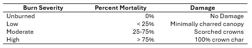
</figure>

## Ecological Impacts
Figure 8 shows the distribution of key species throughout the burn area in 2018. The eastern and western regions of the Cascade Mountains differ in climate and vegetation populations. The western side is wetter and largely populated with moist conifer species, mostly Douglas Firs. Moving eastward, the forest transitions from Douglas Firs to Silver Firs to a mixed population of lodgepole pine and sagebrush in the high desert, which due to the rain shadow effect, is dominated by dry species. Despite the differing climates and species populations, the overall size and shape of the two fires is roughly symmetrical.

<figure>
  <figcaption style="font-size:0.9em; margin-bottom:8px;">
    <strong>Table 6.</strong> Burn severity by species. Severe burn footprint represents the percentage of each species classified as moderate or high severity.
  </figcaption>
  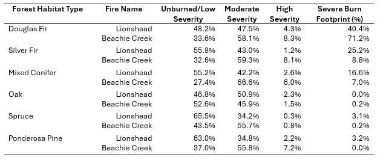
</figure>

<figure>
  <figcaption style="font-size:0.9em; margin-bottom:8px;">
    <strong>Figure 8.</strong> Ecological land cover of the Beachie Creek–Lionshead area in 2018. 
    <em>Map Author: Dustin Littlefield PCS: WGS 1984 UTM 10N 
    Source: Institute for Natural Resources (2018)</em>
  </figcaption>
  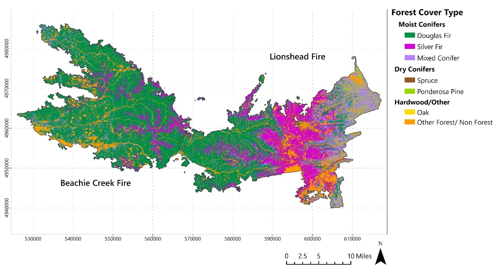
</figure>

Historically, the Western Cascades have been considered resistant to high severity fires due to the cooler moist climate. However, recent research from Huang et al. (2025) has found that the region is experiencing increased canopy loss and fire severity due to a rise in fuel dryness. Table 6 breaks down the burn severity by species in each region. The burn had different impact profiles in the east and western regions. Douglas Firs suffered the largest mortality of any species accounting for 71.2% of the total burn area in Beachie Creek and 40.4% of the Lionshead fire. In the west, 8.3 % of the Douglas Fir population was classified as high severity in the Beachie Creek fire. Lionshead saw less severity overall as all species high severity levels measure less than 5%.

Table 7 compares the mortality of different age classes in both incidents. The highest mortality for both fires was medium or mature growth forest with 48,952 acres destroyed in Beachie Creek and 31,532 acres lost in Lionshead. There was a disproportionate impact on old growth forest in the Beachie Creek fire, where 52.1% (18,931 acres) of its total population experienced mortality greater than 25%. Lionshead saw roughly equal loss of mortality in each age class, with a slightly higher loss in young growth.

<figure>
  <figcaption style="font-size:0.9em; margin-bottom:8px;">
    <strong>Table 7.</strong> Age‑class mortality statistics for the Beachie Creek and Lionshead fires.
  </figcaption>
  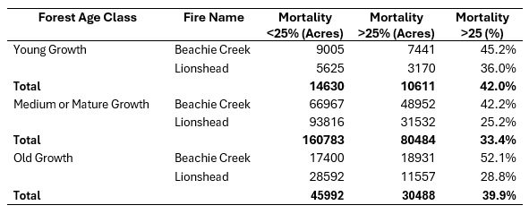
</figure>

## Conclusion
Remote sensing plays an essential role in addressing the social and ecological impacts of wildfire events in the Pacific Northwest. Derived analysis from post-fire satellite imagery can provide valuable insights into evacuation planning, forest cleanup and recovery, and emergency response coordination. Using Sentinel-2 spectral data, indices like the NDVI, NBR, and dNBR can aid in delineating the fire perimeter, revealing spatial burn and damage patterns, and quantifying the degree of severity. 

In this case, the fires’ most severe social impacts were driven by a severe wind event on Labor Day, intensifying fire behavior and causing severe levels of damage in the towns of Detroit and Gates along western Highway 22. Ecologically, the fire caused substantial reductions in overall vegetative biomass throughout both burn regions and a loss of roughly half of the old growth forest population in the Beachie Creek fire. These insights highlight the critical role that remote sensing plays in support of forest and fire management in the Pacific Northwest.

## References

Halofsky, J. E., Peterson, D. L., & Harvey, B. J. (2020). Changing wildfire, changing forests: The effects of climate change on fire regimes and vegetation in the Pacific Northwest, USA. Fire Ecology, 15(1), 1–26. https://doi.org/10.1186/s42408-019-0062-8

European Space Agency. (2020). Sentinel-2B MSI Level-2A imagery [Tiles 10TEQ, 10TFQ]. Retrieved October 29, 2020, from Copernicus Data Space Ecosystem: https://dataspace.copernicus.eu/browser/

Institute for Natural Resources. (2018) Oregon Vegetation and Habitat Mapping. Oregon State University. Retrieved March 5, 2026, from https://inr.oregonstate.edu/mapping-natural-vegetation/vegetation-and-habitat-maps

Van Wagtendonk, J. W., Root, R. R., & Key, C. H. (2004). Comparison of AVIRIS and Landsat ETM+ detection capabilities for burn severity. Remote Sensing of Environment, 92(3), 397–408. https://doi.org/10.1016/j.rse.2003.12.015

U.S. Geological Survey. (n.d.). Glossary: dNBR (Differenced Normalized Burn Ratio). Burn Severity Portal. https://burnseverity.cr.usgs.gov/glossary#dnbr

Huang, C., Zald, H. S. J., Wulder, M. A., & Coops, N. C. (2025). Elevated forest canopy loss after wildfires in moist and cool forests in the Pacific Northwest. Earth’s Future, 13(2). https://doi.org/10.1029/2025EF006373
